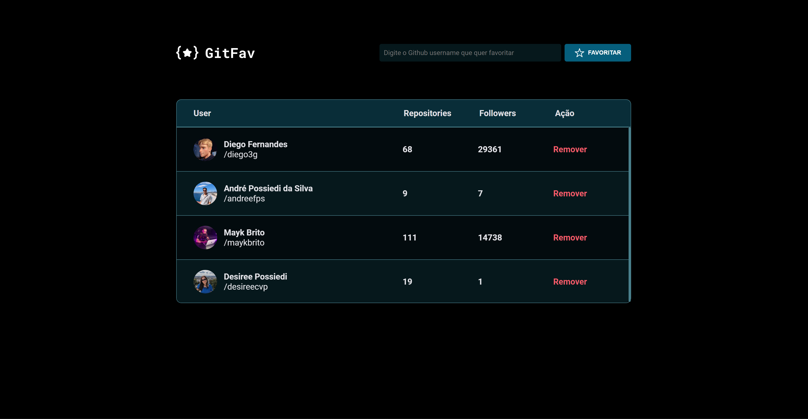
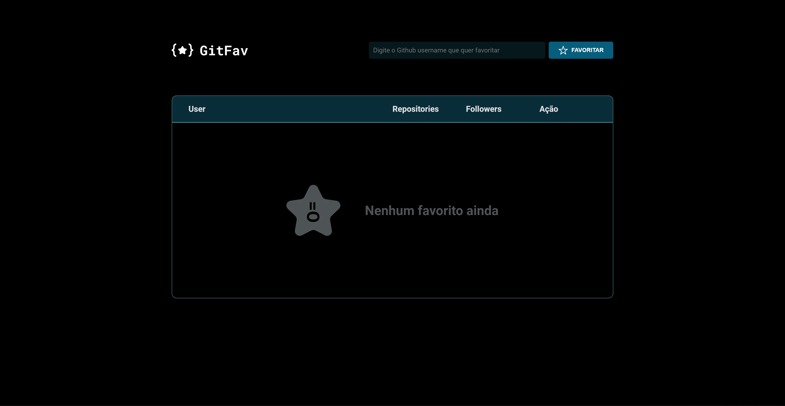

# GitFavs

- Programa desenvolvido para o uso de criação de uma lista de favoritos do Github

✨ Clique para acessar o projeto [AQUI] https://desireecvp.github.io/GitFav/

 

> ## 📝 Conceitos estudados 
 

- Construindo tabelas no HTML
- Definindo acessibilidade com Screen Reader Only
- Conceitos da POO
- Classes
- Herança
- Polimorfismo
- Criando HTML com JavaScript
- Imutabilidade para trabalhar com os dados da aplicação
- LocalStorage
- Métodos estáticos e promessas
- Async Await
- API
- fetch()
- Desestruturação no JavaScript
- Método filter()

 

> ## Tecnologias Usadas
 

- HTML5
- CSS3
- JavaScript
